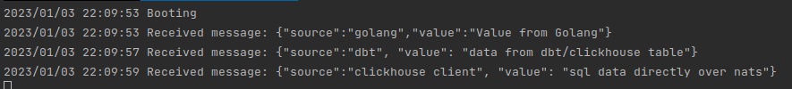
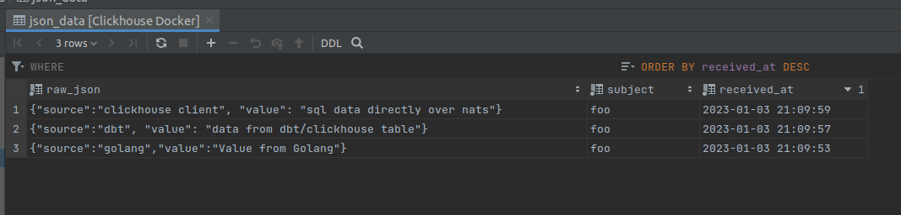

# POC: Trying out streaming (semi)directly from dbt to Nats through clickhouse
From your dbt project, publish directly to NATS with incremental materializations

Note: This is a test setup to see if everything is connectable

# Docker-compose
Starts a nats server and a clickhouse run with `docker-compose up -d`

# Preparing DB
Run the following queries

```sql
-- Actual nats connection see https://clickhouse.com/docs/en/engines/table-engines/integrations/nats/
DROP TABLE IF EXISTS json_queue;
CREATE TABLE json_queue (raw_json String) ENGINE = NATS
SETTINGS nats_url = 'nats:4222',
     nats_subjects = 'foo',
     nats_format = 'LineAsString';

-- Create a destination table
DROP TABLE IF EXISTS json_data;
CREATE TABLE json_data (raw_json String, subject String, received_at DATETIME64)
    ENGINE = MergeTree() order by received_at;

-- Listener to the nats table, materializes into destination table
DROP TABLE IF EXISTS json_consumer;
CREATE MATERIALIZED VIEW json_consumer TO json_data
    AS SELECT raw_json, _subject as subject, NOW() as received_at FROM json_queue;

-- For raw sample data / DBT like data
drop table if exists data;
CREATE TABLE data (
    json String
  ) ENGINE = MergeTree
order by json;

-- Insert sample data for later use (dbt)
INSERT INTO data (json) FORMAT JSONAsString {"source":"dbt", "value": "data from dbt/clickhouse table"};

```

# main.go
run with `go run main.go`

Connects to nats and publishes a message, listens to further messages for 180 seconds.

# dbt
`make dbt` builds a dbt image with clickhouse adapter

You can then run `bin/edbt --version` to check

## dbt profiles clickhouse example

location `~/.dbt/profiles.yml`

```yaml
ch_docker:   
    target: dev
    outputs:
        dev:
          type: clickhouse
          driver: http
          schema: default
          user: default
          password: ""
          #optional fields
          port: 8123
          host: 127.0.0.1
```

## dbt running
dbt project root  is located in `dbt`, from dbt folder `../bin/edbt run`

Running examples:

```shell
../bin/edbt run
../bin/edbt test

# usually with a profile
../bin/edbt run --profile <profile>

# Profile icm with just a subfolder
../bin/edbt run --select example  --profile ch_docker
```

## dbt model
With incremental, dbt behaves like 'insert into' when the table already exist. When inserting data in the `json_queue` table, data gets published to nats.

`dbt/models/example/json_queue.sql`
```dbt 
{{
    config(
        materialized='incremental'
    )
}}

/* Only publish data which does not exist yet */
select json from data where json not in (select raw_json from json_data)
```

# Execution / Result

1. Start docker-compose
2. Run queries
2. run main.go
3. run dbt
4. run manual insert

Setup 2 terminals, in 1 run `go run main.go` and the other run `make dbt_run` , while open run the following query `INSERT INTO json_queue (raw_json) FORMAT JSONAsString {"source":"clickhouse client", "value": "sql data directly over nats"};`

Output of the `main.go` should look something like:



Clickhouse table:


